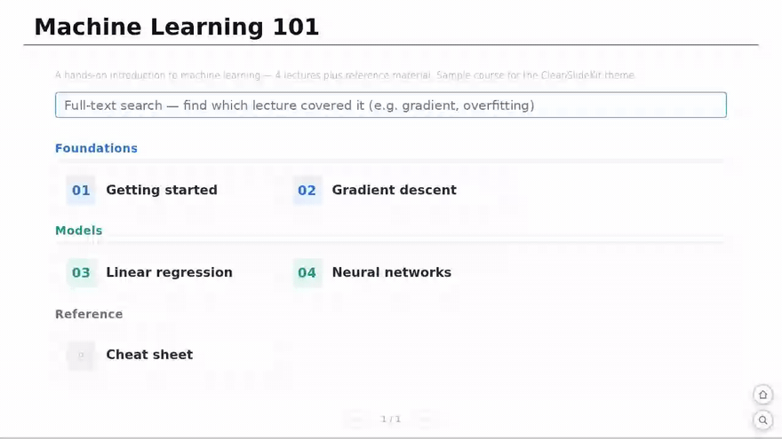
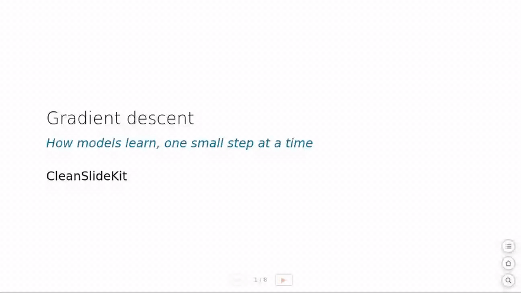
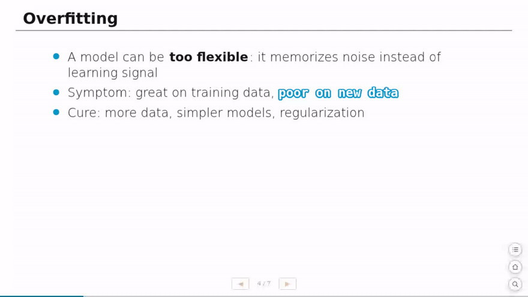
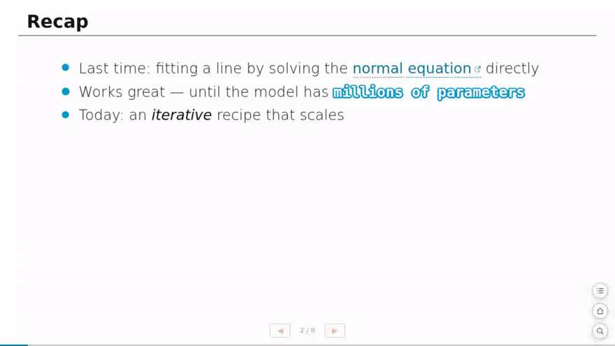
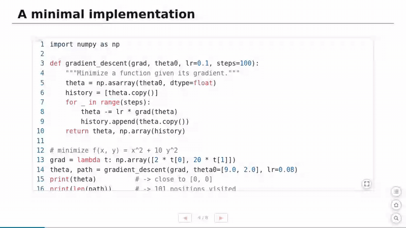

# CleanSlideKit RevealJS

[](_extensions/cleanslidekit/_extension.yml)


**A batteries-included Quarto reveal.js format for teaching.** One
`quarto add` gets you a clean theme *plus* a complete classroom UI — a
slide-list drawer, site-wide search, cross-deck slide peek, full-screen code
zoom, course-index card grids, real-PDF handouts — with **zero configuration
and no build step**. Distilled from a real, in-production AI / data-science
lecture series: every feature here exists because a classroom needed it.

The theme is derived from [`clean`](https://github.com/grantmcdermott/quarto-revealjs-clean)
by Grant McDermott; everything else (the UI kit, Lua filters, JP typography)
is added on top.

## Quick start

```bash
quarto add rkskmt/quarto-cleanslidekit-revealjs
```

```yaml
---
title: "My lecture"
format: cleanslidekit-revealjs
---
```

That's it — no paths to wire up, nothing to `include-in-header`. The CSS and
all six UI modules ship with the extension and are copied next to your
rendered deck automatically. For a live tour, render [`example.qmd`](example.qmd)
(single deck) or the [`sample/`](sample/) course site — the GIFs below are
recorded from the latter.

## Highlights

- 🧭 **Course-site navigation** — footer prev/next + slide counter, a Home
  button on every deck, and index ↔ deck round-tripping that remembers where
  you were.
- 📋 **Slide-list drawer** — <kbd>t</kbd> opens an instant list of every
  slide title; jump anywhere in a 40-slide deck in two keystrokes.
- 🔍 **Site-wide search** — full-text search across *all* decks of the
  course, available from any slide.
- 🫣 **Slide peek** — link to one slide of *another* deck; it opens in a
  modal, fully rendered, without navigating away.
- 💻 **Code that teaches** — copy buttons, a full-screen code zoom with
  pan & font-size control, dashed "Result" frames, code-fold answers styled
  as buttons.
- 🏵️ **Rosette badges** — mark slides *important / practice / FYI* with one
  class; badges also show as colored dots in the slide list.
- ✍️ **Authoring shorthands** — seven Lua filters for `==highlights==`,
  image + citation slides, figure scaling, Plotly embeds, and more.
- 🗂️ **Course index pages** — an auto-numbered, color-coded card grid for
  your lecture list, plus a matching handouts page.
- 📄 **Real-PDF handouts** — an author-side tool that prints decks to
  vector, selectable-text PDFs (handout or one-per-slide mode).
- 🇯🇵 **Japanese-first, English-ready** — `lang: ja` defaults, full-width-colon
  alignment, an `.en` style for English co-notation; all UI strings switch
  between Japanese and English with the document `lang`.

---

## The UI kit

Six small vanilla-JS modules (no framework, no build step) load on every
deck. Everything degrades gracefully — remove a file and the rest keeps
working.

### Navigation chrome (`slide-ui.js`)

A prev/next + `n / N` counter sits in the footer, and a Home button
(bottom-right) returns to `index.html`. The whole course behaves like one
site: pressing **← on a deck's first slide** goes back to the index, and
pressing **→ on the index** returns you to the exact slide you left
(remembered per tab). Touch-safe on tablets — ghost clicks and double-fired
gestures are coalesced into single steps.

The same module quietly fixes classroom papercuts: an opened code-fold that
would expand off-screen is scrolled into view, data-URI images (e.g. d2's
inline SVGs) open correctly in the lightbox, and the selected tab of any
tabset is **remembered per page** across visits.



### Slide-list drawer (`toc-ui.js`)

<kbd>t</kbd> or <kbd>Ctrl+L</kbd> (or the list button, bottom-right) opens a
side drawer listing every slide title — built straight from the DOM, no
thumbnail rendering, so it opens instantly even on long decks.
<kbd>↑</kbd><kbd>↓</kbd> + <kbd>Enter</kbd> to jump, <kbd>Esc</kbd> to close.
Break slides render as section dividers, badge slides get a colored dot, and
the current slide is highlighted and scrolled into view.



### Site-wide search (`search-ui.js`)

A search button on every deck (or <kbd>Ctrl+F</kbd> / <kbd>/</kbd>) opens a
modal that searches the **entire course** via Quarto's generated
`search.json` — students can find "過学習" across all lectures without
knowing which deck it was in. An inline `#search-input` / `#search-results`
pair on the index page is wired up automatically if present.



### Slide peek (`peek-ui.js`)

```markdown
[前回の復習](other-deck.qmd#slide-id){.peek}
```

opens **that one slide** from another deck in a modal overlay. The target
deck really loads (in an iframe), so MathJax, Plotly, code highlighting —
everything — renders exactly as in the original. But all navigation inside
the peek is disabled: students glance, remember, close (<kbd>Esc</kbd> /
backdrop / ×), and are right back where they were — no wandering off into
another deck mid-lecture. Give the target slide an explicit id:
`## 見出し {#slide-id}`.



### Code zoom (`slide-ui.js`)

Every multi-line code block gets copy and expand buttons. Expand opens a
full-screen modal: <kbd>Ctrl</kbd>+wheel adjusts font size, hold
<kbd>Space</kbd> and drag to pan, one click copies, <kbd>Esc</kbd> closes.
Perfect for "can you see the back row?" moments.



### Rosette badges (`badge-ui.js`)

```markdown
## 大事なスライド {.badge-important}
## 演習 {.badge-practice-ja}
## 参考 {.badge-fyi .badge-important}   <!-- badges stack side by side -->
```

Puts a scalloped rosette badge at the title's right shoulder — SVG generated
client-side, pinned to the slide (it never drifts on tall screens). Presets:
`important` / `practice` / `fyi`, each with a `-ja` variant that puts the
Japanese word in the center.

---

## Authoring shorthands (Lua filters)

Seven self-contained filters, active out of the box:

| Write | Get | Filter |
|---|---|---|
| `==誤差逆伝播==`, `==multi word too==` | inline highlight (white-on-blue marker); phrases may span spaces, a literal `a == b` stays untouched | `hl.lua` |
| `## **Tweak**：見出し` | the bolded word becomes a label chip in the title (works with any word) | — (CSS) |
| `過学習（[overfitting]{.en}）` | English co-notation typography; bold inside for spell-outs: `DNN（[**Deep Neural Network**]{.en}）` | — (CSS) |
| `：` anywhere | full-width colons aligned consistently (JP) | `fw-colon.lua` |
| `::: {.fig-cite src="img.png" height="400px"}` + nested `::: {.cite}` | sized image with a source-citation line | `cite-image.lua` |
| `## {.bg-cover src="img.png"}` | full-bleed background-image slide (+ `.cite` for the credit) | `cite-image.lua` |
| `::: {.fig width="50%"}` around a code cell | scales the *computed* figure — revealjs normally drops `out-width` for these | `figscale.lua` |
| `::: {.plotly-iframe src="fig.html" width="900" height="520"}` | a Plotly HTML export embedded as a sized iframe | `plotly-iframe.lua` |

Two more filters work behind the scenes: `slide-body.lua` wraps slide content
for the layout CSS, and `card-grid.lua` hardens the lecture-index grid
against a Pandoc section-hoisting edge case that would otherwise break
navigation.

## Slide components (CSS)

`custom.css` ships a set of ready-made classroom components — plain Pandoc
classes, no inline styles:

- **`.tweak`** — hands-on "change one line & see what happens" practice
  blocks. A two-column table (intent | code) or a bullet list renders as
  auto-numbered row-bands with a coral accent:

  ```markdown
  ::: {.tweak}
  | やりたいこと | コード |
  |--|--|
  | 長く学習させる | `range(1, 4)` → `range(1, 9)` |
  | 中間を太くする | `128` → `512` |
  :::
  ```

- **`.prompt`** — a neutral rounded frame that marks "this paragraph is the
  exercise statement".
- **`.caption-note`** — an annotation caption for whatever sits directly
  above it (a table, a figure, a code block).
- **`.break-slide`** + **`.break-title`** — section-divider slides; they
  also appear as dividers in the slide-list drawer.
- **Result frames** — code-cell stdout renders in a dashed outline with a
  small "Result" tag, visually distinct from source code.
- **Callouts, restyled** — Quarto callouts get solid colored header bars
  with white text/icons, tuned for slide contrast.
- **Code-fold as button** — `code-fold` summaries ("解答例を見る") render as
  an obvious clickable button.
- **Compact tabsets** — Quarto's native `.panel-tabset` restyled as a small
  segmented control, with the selected tab remembered per page.

## Lecture index

A card-grid component turns your course's **index page** into numbered,
color-coded lecture cards — no inline CSS, just classes:

````markdown
## My course

[PDF](handouts.qmd){.pdf-gate}          <!-- top-right gate → handouts page -->

:::: {.lectures}

### Getting started {.sec .cat1}
::: {.grid .cat1}
- [Lecture one](lecture-one.qmd)
- [Lecture two](lecture-two.qmd)
:::

### Going deeper {.sec .cat2}
::: {.grid .cat2}
- [Lecture three](lecture-three.qmd)
:::

### Appendix {.sec}
::: {.grid .app}
- [Extra material](extra.qmd)
:::

::::
````

- **Auto-numbered** — `01, 02, …` via a CSS counter (continuous across
  categories, survives reordering — don't put numbers in the link text).
- **Per-category color** — `.cat1`–`.cat5` (blue / green / amber / purple /
  pink); put the same `.catN` on both the `### {.sec}` header and its
  `::: {.grid}`.
- **`.app`** — an un-numbered (`◦`) group for appendix / reference items.
- **Handouts page** — a sibling `handouts.qmd` with the same grid but
  `::: {.grid .catN .dl}` linking PDFs; `.dl` adds a PDF doc icon, and the
  `.pdf-gate` link on the index points to it. (Generate the PDFs with
  [`tools/qmd2pdf`](tools/).)
- **Term tabs** — split a long index (e.g. two semesters) by wrapping the
  grids in Quarto's native tabset; it renders as a compact segmented control
  and the selected term is remembered when students come back:

  ````markdown
  :::: {.panel-tabset}

  ### 前期

  ::: {.lectures}
  …first-term grids…
  :::

  ### 後期

  ::: {.lectures}
  …second-term grids…
  :::

  ::::
  ````

## PDF handouts (`tools/qmd2pdf`)

An author-side tool (not installed by `quarto add`) that prints any deck to a
**real, vector, selectable-text PDF** via headless Chrome:

```bash
tools/qmd2pdf deck.qmd                 # handout: slides stacked as a flowing document
tools/qmd2pdf deck.qmd --mode slides   # classic one-slide-per-page
tools/qmd2pdf deck.html --no-render    # print an already-built .html
```

Handout mode un-reveals the deck — each slide becomes a natural-height block,
paginated by real rendered height, so overflowing slides and full code
listings are kept intact, not clipped. It handles lazy-loaded images,
`.fig-cite` photo slides, and even WebGL content (Plotly 3D / maps) via
software rendering. See [`tools/README.md`](tools/README.md).

## Keyboard cheat sheet

| Key | Where | Action |
|---|---|---|
| <kbd>t</kbd> / <kbd>Ctrl+L</kbd> | any slide | open the slide-list drawer |
| <kbd>Ctrl+F</kbd> / <kbd>/</kbd> | any slide | open site-wide search |
| <kbd>↑</kbd><kbd>↓</kbd> + <kbd>Enter</kbd> | drawer | move / jump |
| <kbd>←</kbd> on the first slide | deck | back to the index |
| <kbd>→</kbd> on the index | index | return to the slide you left |
| <kbd>Ctrl</kbd>+wheel | code zoom | adjust font size |
| <kbd>Space</kbd>+drag | code zoom | pan |
| <kbd>Esc</kbd> | any modal | close |

Every modal suspends reveal.js's own keyboard while open — arrow keys never
navigate the deck out from under a dialog, and keys are never hijacked while
you type in an input.

## Defaults you may want to override

- **`lang: ja`** is set by default (these decks are Japanese). Override per
  document with `lang: en` in your front matter — the UI strings (search,
  slide list, peek, code zoom) follow it automatically.
- Geometry is `1280×720`, `margin: 0.06`, `scrollable: true`, `menu: false`,
  `highlight-style: github`. Mermaid ships with tightened node spacing for
  slide real estate.
- The Home button links to `./index.html` — the assumption is a course site
  where decks sit next to an index page.

## Optional add-ons (not bundled)

These are *separate* Quarto extensions, deliberately left out so the format
renders out of the box. Add them yourself if you want their features, then
list them under `filters:` in your own `_quarto.yml` / front matter.

```bash
quarto add quarto-ext/lightbox        # image lightbox; then: lightbox: auto
quarto add data-intuitive/d2          # d2 diagrams (also needs the `d2` binary)
```

## MathJax (math rendering)

Math works out of the box: Quarto's revealjs supplies **MathJax v2.7.9** from a
CDN, so nothing is bundled here. If you need a fully **offline** deck, vendor
MathJax yourself and point at it in your document:

```yaml
format:
  cleanslidekit-revealjs:
    html-math-method:
      method: mathjax
      url: "./libs/mathjax/MathJax.js"
```

(Note: Quarto's reveal math plugin hardcodes the `TeX-AMS_HTML-full` config and
ignores `?config=` query overrides — vendor the matching v2.7.9 build.)

## License

MIT — see [LICENSE](LICENSE). Theme derived from
[quarto-revealjs-clean](https://github.com/grantmcdermott/quarto-revealjs-clean)
(MIT) by Grant McDermott.
